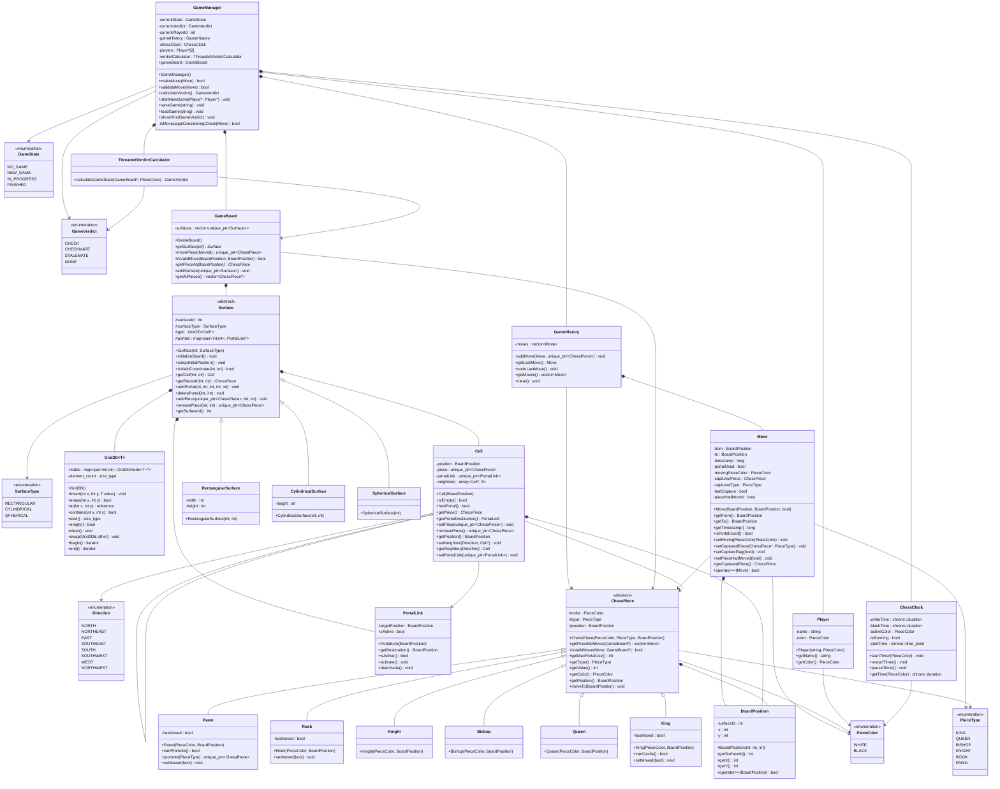

```mermaid
classDiagram
    class GameState {
        <<enumeration>>
        NO_GAME
        NEW_GAME
        IN_PROGRESS
        FINISHED
    }

    class GameVerdict {
        <<enumeration>>
        CHECK
        CHECKMATE
        STALEMATE
        NONE
    }

    class PieceColor {
        <<enumeration>>
        WHITE
        BLACK
    }

    class SurfaceType {
        <<enumeration>>
        RECTANGULAR
        CYLINDRICAL
        SPHERICAL
    }

    class PieceType {
        <<enumeration>>
        KING
        QUEEN
        BISHOP
        KNIGHT
        ROOK
        PAWN
    }

    class Direction {
        <<enumeration>>
        NORTH
        NORTHEAST
        EAST
        SOUTHEAST
        SOUTH
        SOUTHWEST
        WEST
        NORTHWEST
    }

    class Grid2D~T~ {
        -nodes : map~pair~int,int~, Grid2DNode~T~*~
        -element_count : size_type
        +Grid2D()
        +insert(int x, int y, T value) void
        +erase(int x, int y) bool
        +at(int x, int y) reference
        +contains(int x, int y) bool
        +size() size_type
        +empty() bool
        +clear() void
        +swap(Grid2D& other) void
        +begin() iterator
        +end() iterator
    }

    class GameManager {
        -currentState : GameState
        -currentVerdict : GameVerdict
        -currentPlayerId : int
        -gameHistory : GameHistory
        -chessClock : ChessClock
        -players : Player*[2]
        -verdictCalculator : ThreadedVerdictCalculator
        +gameBoard : GameBoard
        +GameManager()
        +makeMove(Move) bool
        +validateMove(Move) bool
        +calculateVerdict() GameVerdict
        +startNewGame(Player*, Player*) void
        +saveGame(string) void
        +loadGame(string) void
        +showHint(GameVerdict) void
        -isMoveLegalConsideringCheck(Move) bool
    }

    class GameHistory {
        -moves : vector~Move~
        +addMove(Move, unique_ptr~ChessPiece~) void
        +getLastMove() Move
        +undoLastMove() void
        +getMoves() vector~Move~
        +clear() void
    }

    class ChessClock {
        -whiteTime : chrono::duration
        -blackTime : chrono::duration
        -activeColor : PieceColor
        -isRunning : bool
        -startTime : chrono::time_point
        +startTimer(PieceColor) void
        +restartTimer() void
        +pauseTimer() void
        +getTime(PieceColor) chrono::duration
    }

    class Player {
        -name : string
        -color : PieceColor
        +Player(string, PieceColor)
        +getName() string
        +getColor() PieceColor
    }

    class BoardPosition {
        -surfaceId : int
        -x : int
        -y : int
        +BoardPosition(int, int, int)
        +getSurfaceId() int
        +getX() int
        +getY() int
        +operator==(BoardPosition) bool
    }

    class Move {
        -from : BoardPosition
        -to : BoardPosition
        -timestamp : long
        -portalUsed : bool
        -movingPieceColor : PieceColor
        -capturedPiece : ChessPiece*
        -capturedType : PieceType
        -hadCapture : bool
        -pieceHadMoved : bool
        +Move(BoardPosition, BoardPosition, bool)
        +getFrom() BoardPosition
        +getTo() BoardPosition
        +getTimestamp() long
        +isPortalUsed() bool
        +setMovingPieceColor(PieceColor) void
        +setCapturedPiece(ChessPiece*, PieceType) void
        +setCaptureFlag(bool) void
        +setPieceHadMoved(bool) void
        +getCapturedPiece() ChessPiece*
        +operator==(Move) bool
    }

    class GameBoard {
        -surfaces : vector~unique_ptr~Surface~~
        +GameBoard()
        +getSurface(int) Surface*
        +movePiece(Move&) unique_ptr~ChessPiece~
        +isValidMove(BoardPosition, BoardPosition) bool
        +getPieceAt(BoardPosition) ChessPiece*
        +addSurface(unique_ptr~Surface~) void
        +getAllPieces() vector~ChessPiece*~
    }

    class Surface {
        <<abstract>>
        #surfaceId : int
        #surfaceType : SurfaceType
        #grid : Grid2D~Cell*~
        #portals : map~pair~int,int~, PortalLink*~
        +Surface(int, SurfaceType)
        +initializeBoard() void
        +setupInitialPosition() void
        +isValidCoordinate(int, int) bool
        +getCell(int, int) Cell*
        +getPieceAt(int, int) ChessPiece*
        +addPortal(int, int, int, int, int) void
        +deletePortal(int, int) void
        +addPiece(unique_ptr~ChessPiece~, int, int) void
        +removePiece(int, int) unique_ptr~ChessPiece~
        +getSurfaceId() int
    }

    class RectangularSurface {
        -width : int
        -height : int
        +RectangularSurface(int, int)
    }

    class CylindricalSurface {
        -height : int
        +CylindricalSurface(int, int)
    }

    class SphericalSurface {
        +SphericalSurface(int)
    }

    class Cell {
        -position : BoardPosition
        -piece : unique_ptr~ChessPiece~
        -portalLink : unique_ptr~PortalLink~
        -neighbors : array~Cell*, 8~
        +Cell(BoardPosition)
        +isEmpty() bool
        +hasPortal() bool
        +getPiece() ChessPiece*
        +getPortalDestination() PortalLink*
        +setPiece(unique_ptr~ChessPiece~) void
        +removePiece() unique_ptr~ChessPiece~
        +getPosition() BoardPosition
        +setNeighbor(Direction, Cell*) void
        +getNeighbor(Direction) Cell*
        +setPortalLink(unique_ptr~PortalLink~) void
    }

    class PortalLink {
        -targetPosition : BoardPosition
        -isActive : bool
        +PortalLink(BoardPosition)
        +getDestination() BoardPosition
        +isActive() bool
        +activate() void
        +deactivate() void
    }

    class ChessPiece {
        <<abstract>>
        #color : PieceColor
        #type : PieceType
        #position : BoardPosition
        +ChessPiece(PieceColor, PieceType, BoardPosition)
        +getPossibleMoves(GameBoard*) vector~Move~
        +isValidMove(Move, GameBoard*) bool
        +getMaxPortalUse() int
        +getType() PieceType
        +getValue() int
        +getColor() PieceColor
        +getPosition() BoardPosition
        +moveTo(BoardPosition) void
    }

    class King {
        -hasMoved : bool
        +King(PieceColor, BoardPosition)
        +canCastle() bool
        +setMoved(bool) void
    }

    class Queen {
        +Queen(PieceColor, BoardPosition)
    }

    class Bishop {
        +Bishop(PieceColor, BoardPosition)
    }

    class Knight {
        +Knight(PieceColor, BoardPosition)
    }

    class Rook {
        -hasMoved : bool
        +Rook(PieceColor, BoardPosition)
        +setMoved(bool) void
    }

    class Pawn {
        -hasMoved : bool
        +Pawn(PieceColor, BoardPosition)
        +canPromote() bool
        +promote(PieceType) unique_ptr~ChessPiece~
        +setMoved(bool) void
    }

    class ThreadedVerdictCalculator {
        +calculateGameState(GameBoard*, PieceColor) GameVerdict
    }

    GameManager --> GameState
    GameManager --> GameVerdict
    GameManager *-- GameHistory
    GameManager *-- ChessClock
    GameManager *-- GameBoard
    GameManager o-- Player
    GameManager *-- ThreadedVerdictCalculator

    GameHistory *-- Move
    GameHistory --> ChessPiece

    GameBoard *-- Surface
    GameBoard --> ChessPiece

    Move *-- BoardPosition
    Move --> PieceColor
    Move --> PieceType
    Move --> ChessPiece

    Surface --> SurfaceType
    Surface *-- Grid2D
    Surface *-- Cell
    Surface *-- PortalLink
    Surface <|-- RectangularSurface
    Surface <|-- CylindricalSurface
    Surface <|-- SphericalSurface

    Cell --> ChessPiece
    Cell --> PortalLink
    Cell *-- BoardPosition
    Cell o-- Cell
    Cell --> Direction

    ChessPiece --> PieceColor
    ChessPiece --> PieceType
    ChessPiece *-- BoardPosition
    ChessPiece <|-- King
    ChessPiece <|-- Queen
    ChessPiece <|-- Bishop
    ChessPiece <|-- Knight
    ChessPiece <|-- Rook
    ChessPiece <|-- Pawn

    Player --> PieceColor
    ChessClock --> PieceColor
    ThreadedVerdictCalculator --> GameBoard
    ThreadedVerdictCalculator --> GameVerdict
```

